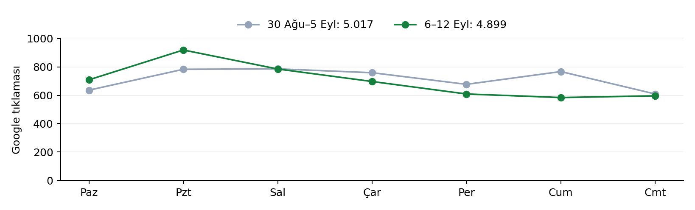

HaldeFiyat Trafik ve büyüme analizi

14 Eylül 2026

# Tıklamalarda %2,4 gerileme var; Ağustos sonuna göre büyüme sürüyor

31 Ağustos–13 Eylül 2026 • 19–30 Ağustos raporunun devamı

**Son haftada küçük, son üç günde daha belirgin bir tıklama düşüşü var. Ancak Ağustos sonuna göre kazanılan büyüme korunuyor.** Genel tabloyu “trafik çöktü” diye okumak doğru değil; kayıp birkaç güçlü sayfada yoğunlaşıyor.

| Kesinleşmiş Google Web verisi     | Önceki | Son dönem | Değişim |
|-----------------------------------|--------|-----------|---------|
| 13 gün: 18–30 Ağu → 31 Ağu–12 Eyl | 7.316  | 9.280     | +26,8%  |
| 7 gün: 30 Ağu–5 Eyl → 6–12 Eyl    | 5.017  | 4.899     | -2,4%   |
| 3 gün: 3–5 Eyl → 10–12 Eyl        | 2.053  | 1.789     | −%12,9  |

## Gösterimler azalıyor; site genelinde tıklanma oranı iyileşiyor

| Son 7 gün / önceki 7 gün | Önceki  | Son     | Fark             |
|--------------------------|---------|---------|------------------|
| Gösterim                 | 151.317 | 144.140 | −%4,7            |
| CTR                      | 3,32%   | 3,40%   | +0,08 yüzde puan |
| Ortalama pozisyon        | 6,34    | 6,31    | Hafif iyileşme   |

Tıklama = gösterim × CTR ayrıştırmasında, gösterim kaybı önceki CTR ile yaklaşık **−238 tıklama**; CTR iyileşmesi yeni gösterim hacmiyle yaklaşık **+120 tıklama** etkisi yapıyor. Net fark **−118**. Bu matematiksel ayrıştırmadır; gösterimin neden azaldığını tek başına açıklamaz.

GSC’nin son kesinleşmiş günü 12 Eylül. 13 Eylül’de görünen 559 tıklama hâlâ taze/kısmi; ana karşılaştırmalara alınmadı. Log ve GA4 raporu ise 13 Eylül dâhil 14 tam günü kapsar. Pencereler kaynak bazında açıkça ayrılmıştır.

HaldeFiyat Trafik ve büyüme analizi

14 Eylül 2026

# Kayıp birkaç güçlü sayfada yoğunlaşıyor

Aşağıdaki sayfa ve sorgu karşılaştırmaları 30 Ağustos–5 Eylül ile 6–12 Eylül arasındadır.

## En büyük kayıp İstanbul hal sayfasında

| Sayfa                  | Tıklama   | Fark | Gösterim Δ | Pozisyon    |
|------------------------|-----------|------|------------|-------------|
| /hal/istanbul-hal-ibb  | 548 → 382 | -166 | -26,8%     | 4,97 → 5,08 |
| /hal/kahramanmaras-hal | 175 → 116 | -59  | -27,3%     | 4,60 → 4,39 |
| /urun/sogan-kuru       | 178 → 141 | -37  | -18,0%     | 5,64 → 5,82 |
| /                      | 145 → 109 | -36  | -33,7%     | 8,47 → 7,88 |
| /urun/domates-salcalik | 66 → 31   | -35  | -45,2%     | 6,98 → 7,15 |
| /urun/incir-beyaz      | 50 → 20   | -30  | -57,2%     | 5,16 → 5,70 |
| /hal/bursa-hal         | 157 → 129 | -28  | -28,0%     | 6,28 → 5,83 |
| /urun/patates          | 194 → 166 | -28  | -1,5%      | 5,61 → 6,11 |

İstanbul’daki **−166 tıklama**, tek başına site net kaybından büyük; çünkü Ankara hal sayfasındaki **+119** ve yeni sayfalardaki kazanımlar kaybı dengeliyor. Kahramanmaraş’ta gösterim azalırken ortalama pozisyon iyileşmiş. Bu nedenle tüm kaybı sıralama düşüşü olarak sınıflandırmak doğru olmaz.

## Bölümler: yeni şehir–ürün ve analiz sayfaları denge sağlıyor

| Bölüm        | Önceki tıklama | Son tıklama | Fark |
|--------------|----------------|-------------|------|
| /urun/\*     | 2.254          | 2.140       | -114 |
| /hal/\*      | 1.745          | 1.641       | -104 |
| /firmalar/\* | 827            | 734         | -93  |
| /            | 145            | 109         | -36  |
| /fiyat/\*    | 0              | 159         | 159  |
| /analiz/\*   | 63             | 116         | 53   |
| /piyasa/\*   | 11             | 45          | 34   |

## Sorgu düzeyinde müdahale edilecek yerler

| Sorgu                       | Tıklama  | CTR            | Pozisyon    |
|-----------------------------|----------|----------------|-------------|
| istanbul hal fiyatları      | 114 → 57 | 6,57% → 3,81%  | 3,70 → 4,43 |
| adana mayer limon fiyatları | 46 → 26  | 13,61% → 7,28% | 7,76 → 6,07 |
| patates fiyatları           | 55 → 39  | 7,82% → 5,38%  | 5,78 → 6,38 |
| ataşehir hal fiyatları      | 17 → 4   | 9,44% → 2,52%  | 4,90 → 5,81 |
| içerenköy hal fiyatları     | 20 → 7   | 10,53% → 4,49% | 4,95 → 4,90 |

“İstanbul hal fiyatları” sorgusunda hem sıralama hem CTR geriliyor; buna karşılık “Adana mayer limon fiyatları” sorgusunda pozisyon iyileşirken tıklama düşüyor. Başlık, arama sonucu görünümü ve ilgili sayfalar arasındaki dağılım sorgu bazında incelenmeli. **Mevsimsellik ve rakip etkisi bu verilerle kanıtlanmış değil.**

Sayfa gruplaması 5.081 → 4.974 tıklama (−107), mülk toplamı 5.017 → 4.899 (−118) verir. GSC’nin sayfa/mülk toplulaştırma kuralları farklıdır; sayfa toplamı mülk toplamına zorlanmadı. Görünür sorgular tıklamaların yalnız %52,5 → %50,7’sini kapsıyor; gizlenen sorgular nedeniyle sorgu kayıpları eksiksiz dağılım değildir.

HaldeFiyat Trafik ve büyüme analizi

14 Eylül 2026

# Site trafiği iki haftada büyüdü; son haftanın pageview sayacı yavaşladı

Log kıyası: 17–30 Ağustos → 31 Ağustos–13 Eylül; her iki pencere 14 gün.

| Log metriği                              | Önceki 14 gün | Son 14 gün | Değişim |
|------------------------------------------|---------------|------------|---------|
| Toplam HTTP isteği                       | 1.039.644     | 1.515.037  | +45,7%  |
| Bot işareti taşımayan istek              | 973.527       | 1.423.872  | +46,3%  |
| RSC olmayan, HTTP 200 sayfa isteği       | 47.867        | 71.079     | +48,5%  |
| Google referrer’lı HTTP 200 sayfa isteği | 14.723        | 21.066     | +43,1%  |
| Başarılı pageview POST isteği            | 17.167        | 22.123     | +28,9%  |

İki haftalık toplamlar büyüyor. Son iki tam log haftasında ise başarılı pageview isteği **11.322 → 10.801 (−%4,6)**; Google referrer’lı sayfa isteği **9.957 → 11.109 (+%11,6)**. Bu sayaçlar farklı olayları ve zaman dilimlerini ölçtüğü için arama tıklamalarıyla birebir eşleşmez.

## Günlük görünüm

| Gün   | Bot dışı istek | Pageview POST 2xx | Google referrer 200 | GSC tıklama |
|-------|----------------|-------------------|---------------------|-------------|
| 31/08 | 95.198         | 1.656             | 1.371               | 783         |
| 01/09 | 97.952         | 1.760             | 1.383               | 786         |
| 02/09 | 114.512        | 1.846             | 1.398               | 759         |
| 03/09 | 101.525        | 1.666             | 1.419               | 677         |
| 04/09 | 106.872        | 1.625             | 1.502               | 767         |
| 05/09 | 95.385         | 1.415             | 1.469               | 609         |
| 06/09 | 96.365         | 1.354             | 1.415               | 709         |
| 07/09 | 133.855        | 1.911             | 1.930               | 919         |
| 08/09 | 118.984        | 1.879             | 1.982               | 785         |
| 09/09 | 107.828        | 1.616             | 1.836               | 697         |
| 10/09 | 93.523         | 1.616             | 1.469               | 609         |
| 11/09 | 90.842         | 1.327             | 1.626               | 584         |
| 12/09 | 91.509         | 1.300             | 1.185               | 596         |
| 13/09 | 79.522         | 1.152             | 1.081               | 559\*       |

Bot işareti taşımayan isteklerin %75,7’si mobil; GSC son hafta tıklamalarının %91,0’ı mobil. Googlebot 16.143 → 18.469 istek (+%14,4); GPTBot + OAI-SearchBot + ClaudeBot toplamı 4.199 → 6.980 (+%66,2). Bunlar kullanıcı veya yönlendirme trafiği değildir. gclid taşıyan yalnız 2 istek var; reklam platformu okunmadığı için kampanyanın açık/kapalı olduğu sonucu çıkarılmadı.

## RSC isteği, tek başına ziyaret veya prefetch demek değil

Son dönemde sayfa yolu isteklerinin **%90,3’ünde `_rsc` parametresi** bulunuyor. Önceki rapor bunların tamamını “kullanıcının görmediği prefetch” olarak adlandırmıştı. Erişim logu bu ayrımı kanıtlamaz: RSC isteği istemci tarafı gezinmeden de gelebilir. RSC olmayan 200 yanıtları da doğrulanmış insan ziyareti veya oturum değildir; otomasyon, tekrar yükleme ve referrer tekrarları içerebilir.

\*13 Eylül GSC değeri kısmi bilgi olarak gösterildi. Kullanıcı aracına göre bot süzme yaklaşık bir sınıflandırmadır. Pageview sayısı başarılı POST isteklerini sayar; tekil kişi değildir. IP adresleri rapora ve veri çıktısına alınmadı.

HaldeFiyat Trafik ve büyüme analizi

14 Eylül 2026

# İndeksler yerinde; eski CSS istekleri ve veri tazeliği açık

Canlı durum 14 Eylül’de; dönem hataları 31 Ağustos–13 Eylül loglarından kontrol edildi.

## Kayıp sayfalarında toplu indeks kaybı saptanmadı

İstanbul, Kahramanmaraş, kuru soğan, salçalık domates ve patates sayfalarının beşi de URL Inspection’da **PASS / dizine eklendi**. Google canonical ile sayfanın canonical adresi eşleşiyor; son taramalar 14 Eylül, fetch başarılı. Canlı sayfalar HTTP 200 ve index/follow. Bu bulgu bu beş sayfa içindir; bütün site için sıralama veya ceza denetimi değildir.

## 404’lerin ağırlık merkezi eski CSS dosyalarına kaymış

| HTTP göstergesi | 17–30 Ağu | 31 Ağu–13 Eyl |
|-----------------|-----------|---------------|
| 404             | 7.740     | 9.917         |
| 5xx             | 472       | 799           |
| 401             | 639       | 5.814         |
| 429             | 247       | 1.454         |
| 413             | 0         | 27            |

Üç eski CSS yolu **4.620 adet 404** üretiyor; dönem 404’lerinin **%46,6’sı**. Üçü de bugün 404. Güncel HTML’nin çağırdığı iki yeni CSS dosyası ise 200 dönüyor. Bulgular eski sayfa/asset sürümlerinin istenmeye devam ettiğini gösteriyor; bu isteklerin gerçek kullanıcı etkisi ve cache/deploy kaynak zinciri ayrıca doğrulanmalı.

| Eski CSS dosyası  | Dönem 404 |
|-------------------|-----------|
| 1jvrn-slpfpj7.css | 2.003     |
| 3tfwshwg68odk.css | 1.994     |
| 0t9fsotkcm7ew.css | 623       |

Dönem 5xx toplamı **799 (%0,053)**. Bunların 644’ü ilk haftada, 155’i ikinci haftada; ikinci haftada hata hacmi azalıyor. Bu yön, son tıklama düşüşünü genel sunucu kesintisiyle açıklamayı desteklemiyor. Ancak toplam düşük oran, belirli kullanıcı akışlarındaki hataları önemsiz kılmaz.

401 yanıtlarının 5.438’i oturum açılışı/yenileme uçlarında; 429 yanıtlarının 682’si fiyat dışa aktarımında, 768’i üç ürün geçmişi ucunda. Bunlar ayrı akış kontrolleri gerektirir; her 401 yanıtı başarısız kullanıcı girişi değildir. `/api/revalidate` için 429 adet 404 de cache yenileme yolunun incelenmesini gerektiriyor; bu çağrıların içerik tazeliğine etkisi doğrulanmadı.

## Önceki teknik bulguların canlı karşılığı

- **Eski slug yönlendirmeleri çalışıyor:** `/urun/elma-2` → 301; eski firma örneği → 308; ikisi de doğru kanonik sayfada 200 ile bitiyor.
- **Firma parametre sayfası:** `/firmalar?city=bursa&page=2`, Bursa liste sayfasına canonical ve noindex/follow içeriyor.
- **Sitemap:** 860 web URL’si bildirilmiş; GSC’de 0 hata, 0 uyarı; 14 Eylül’de indirilmiş. API’deki “indexed=0” alanı sitenin indekslenmediği şeklinde okunmadı.
- **Veri tazeliği:** Kahramanmaraş sayfası hâlâ “Son Liste 7 Eylül” başlığı taşıyor; bu, günlük fiyat arayan kullanıcı için incelenmesi gereken somut bir içerik açığı.

PageSpeed Insights mobil ve masaüstü çağrıları günlük kota nedeniyle HTTP 429 verdi. Eski 91/100 hız puanı güncelmiş gibi tekrarlanmadı. İstanbul sayfasının tek HTTP indirme ölçümü yaklaşık 4,0 sn; bu değer Lighthouse/CrUX veya TTFB ölçümü değildir.

HaldeFiyat Trafik ve büyüme analizi

14 Eylül 2026

# Davranış göstergeleri iyileşti; bülten ve gelir dönüşümü zayıf kaldı

GA4 ve iş verisi kıyası: 17–30 Ağustos → 31 Ağustos–13 Eylül; 14’er gün.

## GA4’te erişim ve etkileşim artıyor

| GA4 metriği             | Önceki | Son    | Değişim          |
|-------------------------|--------|--------|------------------|
| Oturum                  | 1.030  | 1.297  | +25,9%           |
| Etkin kullanıcı         | 757    | 895    | +18,2%           |
| Yeni kullanıcı          | 681    | 788    | +15,7%           |
| Sayfa görüntüleme       | 2.860  | 3.618  | +26,5%           |
| Ort. oturum süresi (sn) | 160,7  | 181,3  | +12,8%           |
| Anahtar olay            | 21     | 30     | +42,9%           |
| Etkileşim oranı         | 66,41% | 71,01% | +4,60 yüzde puan |

Organik arama oturumları 925 → 1.086; AI Assistant kanalı 11 → 20 oturum. **30 form_submit olayı** ölçülmüş; bu sayı doğrulanmış 30 müşteri veya satış değildir. GA4 sayfa görüntüleme 3.618, logdaki başarılı pageview POST sayısı 22.123: kapsamlar arasında büyük fark sürüyor. Çerez onayı ve ölçüm koşullarının etkisi ayrıştırılmadan bunu sabit bir “yakalama oranı” olarak kullanmamak gerekir.

## Yeni üyeler ve ilanlar var; reklam tahsilatı yok

| İş metriği                       | Önceki  | Son     |
|----------------------------------|---------|---------|
| Yeni üye                         | 8       | 19      |
| Yeni bülten abonesi              | 4       | 1       |
| Banner gösterimi                 | 41.876  | 101.514 |
| Banner tıklaması                 | 47      | 87      |
| Banner CTR                       | %0,112  | %0,086  |
| Reklam ödeme defterinde tahsilat | 0 kayıt | 0 kayıt |
| Firma sahiplenme talebi          | 0       | 0       |
| Yeni ilan                        | 0       | 11      |
| İlan soru/teklif kaydı           | 0       | 2       |
| İlan aranma talebi               | 0       | 0       |
| Dönemde yayımlanan analiz        | 4       | 5       |

14 Eylül anlık durumunda **5 onaylı ve süresi dolmamış ilan** var; önceki rapordaki “aktif ilan yok” bulgusu artık geçerli değil. Reklam ödeme defterinde dönem tahsilatı bulunmadı; bu tespit tüm banka hareketleri veya bütün ürün gelirlerinin muhasebe mutabakatı değildir.

## Bülten ve arama hunisi

Bülten CTA gösterimleri 723 → 813; başarılı form olayları 5 → 2 (%0,69 → %0,25 olay oranı). Yeni abone sayısı 4 → 1. Form başarısı ile yeni abone aynı şey değildir; mevcut abone tekrar gönderebilir. Ürün aramasında fiyat görüntüleme 610 → 841 olay; gönderim 392 → 313; sıfır sonuç 116 → 83 (%29,6 → %26,5). Bunlar oturum bazlı bağlı huni değil, olay toplamlarının oranıdır.

GTM-K3WDGHX5 canlı sürüm 2; tek GA4 Google Tag ve 0 özel trigger. Konteynerin durumu canlı API ile kontrol edildi. Ölçüm kimliklerinin olması, her ziyaretin GA4’e ulaşmasını veya her form olayının ticari dönüşüm olmasını garanti etmez.

HaldeFiyat Trafik ve büyüme analizi

14 Eylül 2026

# Veri kapsamı arttı; güncellik ve kalite sınırları sürüyor

Veri sağlığı ve katalog: canlı veritabanı yeniden okundu; geçmiş değerler de aynı sorguyla hesaplandı.

## Kaynak kapsamı genişliyor, kısmi çalışmalara dikkat

| Veri metriği                           | 17–30 Ağu | 31 Ağu–13 Eyl |
|----------------------------------------|-----------|---------------|
| ETL çalışması                          | 828       | 943           |
| Hata                                   | 5         | 11            |
| Kısmi çalışma                          | 194       | 316           |
| OK ama fetched=0                       | 202       | 118           |
| Fiyat tarihi döneme giren satır        | 21.445    | 20.608        |
| Veri üreten ayrı hal/borsa             | 41        | 46            |
| Orta noktadan türetilmiş ortalama payı | %72,2     | %78,5         |
| Yeni karantina kaydı                   | 490       | 602           |

943 ETL çalışmasının 316’sı kısmi (**%33,5**), 11’i hata (%1,2). “OK” olup sıfır satır çeken çalışma sayısı 202’den 118’e inmiş; tek başına hata sayısını izlemek hâlâ eksik bir resim verir. Bununla birlikte kaynak takvimi, yapılandırma ve kapatılmış kaynaklar kontrol edilmeden her sıfır satır koşusu arıza ilan edilmemeli.

## Kaynak bazında somut takip noktaları

| Kaynak / sayfa      | Veritabanındaki son tarih     | Yorum                                                     |
|---------------------|-------------------------------|-----------------------------------------------------------|
| Kahramanmaraş resmî | 7 Eylül 2026                  | Canlı başlık da aynı; tıklama kaybıyla birlikte öncelikli |
| Tekirdağ resmî      | 1 Ağustos 2026                | Eski rapordaki tazelik açığı sürüyor                      |
| Çorum resmî         | 12 Ağustos 2026               | Güncel kaynak/alternatif akış teyidi gerekli              |
| Antkomder üç kaynak | Dönemde toplam 74 OK/boş koşu | Kaynak kapısı ve beklenen çalışma durumu incelenmeli      |

Karantina girişleri: kaynak medyanından sapma 317, önceki fiyattan sıçrama 183, eş kaynak medyanından sapma 75, ürün–birim uyumsuzluğu 27; toplam **602**. Bu, kuralların şüpheli veriyi yakaladığını gösterir; her kaydın gerçek fiyat hatası olduğunu kanıtlamaz.

## Katalog ve analiz yayını

Katalogda 1.250 ürün kaydı, SEO indeksine açık 249 ürün bulunuyor. Bunlar benzersiz ticari ürün veya fotoğraf sayısı değildir. Önceki raporun 243 SEO ürününe göre kapsam genişlemiş. Bu çalışmada fotoğraf manifestinin kapsamı yeniden sayılmadı; eski 420 fotoğraflı slug değeri güncel kabul edilmedi.

Dönemde 5 analiz yayımlandı. Arama tıklamaları /analiz bölümünde son haftada **63 → 116 (+%84,1)**; CTR %1,23 → %1,99. Önceki rapordaki “analizler gösteriliyor ama tıklanmıyor” sorunu iyileşiyor, tamamen kapanmış değil. Az önce düzenlenen **36 numaralı 7–13 Eylül analizi taslak** durumda; henüz yayın trafiği üretmesi beklenmez.

ETL çalışma toplamları, fiyat tarihi üzerinden satır sayısı ve karantina girişleri farklı tanelerdeki metriklerdir; birbirine eşit olmak zorunda değildir. Backfill/düzeltmeler geçmiş satır sayılarını değiştirebilir. Bu nedenle önceki PDF’nin donmuş sayıları yerine aynı tarihler yeniden sorgulandı.

HaldeFiyat Trafik ve büyüme analizi

14 Eylül 2026

# Öncelik: İstanbul kaybı, CSS sürekliliği ve güncel fiyat verisi

## Önceki raporun aksiyonlarına güncel durum

| Önceki başlık                | 14 Eylül durumu / kanıt                                       |
|------------------------------|---------------------------------------------------------------|
| Eski −2 slug yönlendirmeleri | İki örnekte 301/308 → doğru kanonik 200; bu örnekler kapandı. |
| Firma parametre canonical    | Bursa örneğinde canonical + noindex doğrulandı.               |
| RSC / prefetch yükü          | RSC payı %90,3; oran tek başına prefetch hacmini kanıtlamaz.  |
| Dağıtım kesintileri          | 5xx ikinci haftada azaldı; eski CSS 404’leri ayrı açık.       |
| Analiz başlıkları            | Son haftada +53 tıklama; yeni rapor 36 taslakta.              |
| Şehir–ürün sayfaları         | /fiyat/\* yeni dönemde 159 tıklama; kapsamın katkısı var.     |
| Bülten dönüşümü              | 1 yeni abone; olay bazlı başarı oranı %0,25, açık.            |
| Aktif ilan boşluğu           | 5 onaylı/süresi dolmamış ilan; artık boş değil.               |
| Reklam geliri                | Reklam tahsilat defterinde 0 dönem kaydı; ticari açık.        |
| Sessiz ETL / bayat kaynak    | OK/boş koşu azaldı; Tekirdağ ve Kahramanmaraş tazeliği açık.  |
| Hız / TTFB                   | PSI kota engeli nedeniyle yeni laboratuvar sonucu yok.        |

## Öncelikli devam işleri

- **İstanbul sorgu kaybı:** “İstanbul hal fiyatları” için başlık/snippet ve sorgu–sayfa dağılımını birlikte incele; mevcut sıralama ve CTR kaybını ayrı izle. Geneli etkileyen başlık değişikliği yapmadan önce bu sayfada somut düzeltme taslağı hazırla.
- **CSS sürüm sürekliliği:** En sık istenen üç eski dosyanın hangi sayfa/cache sürümünden geldiğini log referrer ve release dizinleriyle eşleştir. Gerekli eski asset’lerin tutulması veya cache geçişi için dar kapsamlı düzeltme hazırla.
- **Kahramanmaraş tazeliği:** Resmî bültenin tarihi ile ETL’nin son kaydını karşılaştır; güncel kaynak varsa içeriğin geride kalma nedenini gider. Kaynak güncellenmediyse “bugün” izlenimi verme.
- **Bülten ve gelir:** Bültenin 813 gösterimden yalnız 1 yeni abone üretmesini form hata/tekrar kayıt ayrımıyla incele. Reklam satış takibi, gösterim artışından ayrı yönetilmeli.

## Kaynaklar ve karşılaştırmanın sınırları

Kaynaklar: GSC API `sc-domain:haldefiyat.com`, Web araması, `dataState=final`; GA4 property 538279658, yalnız haldefiyat.com/www hostları; GTM canlı sürüm API’si; VPS dedike Nginx logları; HaldeFiyat MySQL salt okuma; beş URL Inspection sorgusu; canlı HTTP kontrolleri. Ham yanıtlar, SQL ve hesaplama kodu raporla birlikte yerel kanıt dizininde tutuldu.

GSC günleri America/Los_Angeles, GA4 Europe/Istanbul, Nginx/DB dönem sınırları UTC’dir. Kaynakların toplamları birleştirilmedi. GSC pozisyonu gösterim ağırlıklıdır; görünürlük ve sorgu bileşimi değişimi tek başına algoritma/rekabet/mevsim etkisini kanıtlamaz. Ana 7 günlük kıyas aynı haftanın günlerini karşılaştırır.

19–30 Ağustos GSC toplamı artık kesinleşmiş veride **6.757**; önceki PDF’deki 6.350 taze/kısmi değerdi. Aynı dönem log ve GA4 sayıları da yeniden hesaplama, güncel filtreler ve sonradan gelen kayıtlar nedeniyle eski PDF ile birebir uyuşmuyor. Eski belge değiştirilmedi; devam raporunda güncel hesaplar ve tanımlar kullanıldı.

API yöntem referansı: [Google Search Analytics: query](https://developers.google.com/webmaster-tools/v1/searchanalytics/query). Rapor hazırlama sırasında site içeriği, SEO ayarı, kampanya, yayın durumu veya veritabanı değiştirilmedi.

